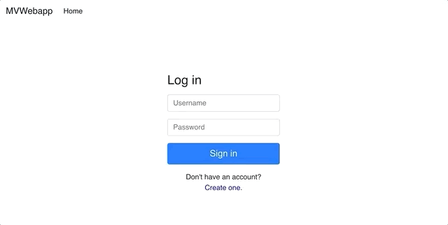

# MVWebapp

A simple single page application with user creation and login using the power of:





Secured with JWTs this application allows a user to
* Create an account
* Login with that account
* See a welcome message on login
* Logout


## Running

Install [Docker](https://www.docker.com/get-started) on your machine and run the following command from the root directory of this project

`docker-compose up`

Note that when running the first time you might see:

```
mvw_flyway | The last packet sent successfully to the server was 0 milliseconds ago. The driver has not received any packets from the server. (Caused by Connection refused (Connection refused)) Retrying in 1 sec...
mvw_flyway | WARNING: Connection error: Communications link failure
```

This is because flyway is waiting for the database to come up run its migrations, it will keep retrying until the database comes up and then you should see:

```
mvw_flyway | Successfully applied 1 migration to schema `mvw` (execution time 00:00.095s)
mvw_flyway exited with code 0
```

Until you see this the API may respond with errors as the database has not yet become available.